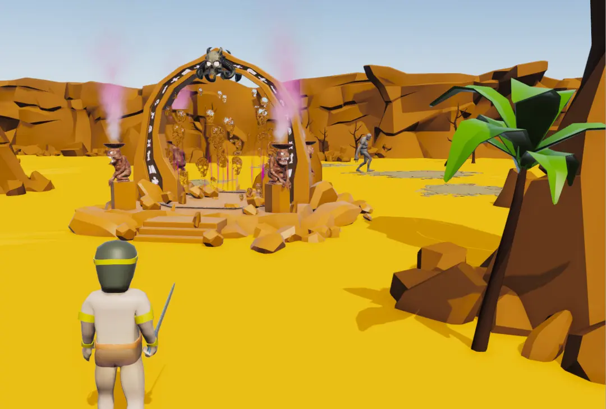

# Conan The Barbarian: Arena Brawler


Conan The Barbarian: Arena Brawler is a 3D "action game" made with Unity in which you play as Conan and fight monsters in a brutal arena. The game combines melee combat, health/mana management, and progression through different waves of enemies.

-not really a game just for illustrate conan adventure.  
-change enemy:E; music:M or , ; move:keyboard and gamepad shift to run.  
-portal:T; quit:esc;  fights are automatic.  
-gain life:cross the life foutains; invinsible:find the Crom stone.

## 🎮 Play the game

- **Itch.io** – Download or play online:  
  [Click here to play on Itch.io](https://calamity-cat.itch.io/conan-the-barbarian)
- **Unity Play** – Web build exported with Unity:  
  [Link to the Unity Play version](https://play.unity.com/fr/games/70428e31-57e5-4097-83b4-3c8832e900c5/conan-the-barbarian)
- **Hosting** – Project website (assets, info, trailer, etc.):  
  [Visit the site hosted on Hostinger](https://darksalmon-jellyfish-454090.hostingersite.com/unity3d_conanbarbarian_arena/index.html)

## 🖥️ Technologies used

- **Unity 3D** – Main game engine
- **C#** – Scripting for combat, monster AI, camera, UI, etc.
- **Unity Physics** – Collisions, rigidbodies, hit detection
- **UI Canvas** – Health bar, wave counter, menu buttons
- **Animation / Animator Controller** – Hit, dodge, combo, and emote animations

## 🧩 Main features

- Melee combat with different attacks (sword swing, punch, charge, etc.)
- Multiple waves of monsters with increasing difficulty
- Health and mana (or stamina) system for Conan
- Dynamic arena camera following Conan and enemies
- Main menu with options for new game and quit
- Simple visual effects (blood particles, flashes, etc.)

## 🚀 How to open the Unity project

1. Clone this repository:  
   ```bash
   git clone https://github.com/your-username/ConanArenaBrawler.git
   ```
2. Open the project with **Unity Hub**.
3. In Unity Hub, click **"Open"** and select the project folder.
4. Once Unity is ready, open the main scene (usually `Assets/Scenes/Main.unity`).
5. Click **Play** to test the game locally.

## 📦 WebGL export (Unity Play)

This project is configured for a web build.

1. Go to **File → Build Settings**.
2. Select **WebGL** as the platform.
3. Click **Build and Run**.
4. Follow the export steps and upload the build to Unity Play or your web host.

## 🧑‍💻 Development goals

This project was created to:
- Learn and practice 3D arena gameplay with Unity.
- Practice managing multiple enemies, camera, and UI.
- Publish a small action game inspired by the *Conan the Barbarian* universe.

## 📜 License

This repository is provided for educational and personal use only.  
For any reuse of assets, models, or significant code, please contact me.

## 📬 Contact

Contact me if you have questions, feedback, or modding ideas:  
[your-email-or-username@example.com](mailto:your-email-or-username@example.com)  
or through GitHub Issues.
